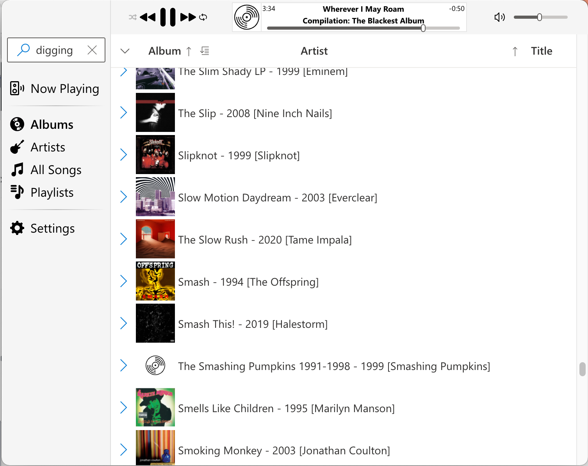
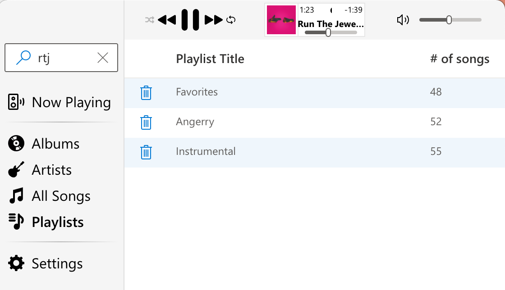

# EMP: Electron Music Player
 > A little Hat Tip to us older Seattleites ;)
### Because macOS iTunes, er, "Music" doesn't play flac files
* Why? Because Apple is lame.

I'm old. I have a whole lot of music that I purchased on CD's over the past
many, many years. I like having high quality music playable from the PC I'm
working on. When that PC was a Windows PC, the incredibly ancient Windows Media
Player would play Flac, as would "Groove Music" I imagine (and anything else
probably, because of the pluggable (and highly overarchitected) nature of
audio/video handling in Windows. But I'm on a Mac on a regular basis these days
and Vox is **awful** (I'm not paying a monthly fee for the privilege of
listening to the music I've already purchased, thanks very much) and VLC is a
bad music player (a great video player, but not great for music, IMO)

What's it look like? Kind of like iTunes' ugly stepsister (#notadesigner!), but here you go:

It's not yet 'packaged' for general consumption, but if you're a nerd, you can probably get it to work from the repository easily enough.

## What's the current state?

I've got playback working. Double-clicking on artists, albums, and songs adds
to the 'Now Playing' list. Repeat & Shuffle generally work the way you expect.
`yarn start` will launch it. Albums with jpg's/png's in the same folder will
display those images in the Album list. Honestly, it's semi-functional.
Playlists are the next major piece of functionality to add.

## Stuff to do

### *In Progress*

Migrate to Recoil. One of the two key authors is on my team, it supports React
suspense, and I've been drooling over it for about a year. Now that it's
been open-sourced, I'm going to switch from undux to recoil.

### Bugs
* Handle audio files that don't fit my schema
  * Probably start with iTunes schema :/

### Core Capabilities
* **both** Restore active tab between runs
* **main** Get album covers from media tags as well as the folder...
* **main** Update data from file metadata (overriding filename acquisition)
  * Save this stuff between runs, as it's going to be *s l o w*.
* **both** MediaInfo/Metadata editing!
  * Support adding album covers
  * File name vs. metadata difference cleanup (this would be *awesome*)
* **both** Add "Recently Added" capabilities
  * Something involving no Key Reuse probably...
* **both** Make 'Search' work.
* **render** Make a miniplayer!
* **both** Add 'favorite/love' attribute for songs
* **both** "Auto" playlists (something involving stuff like "this artist" and "not this
keyword" kind of stuff.
* **both** Import/Export M3U's?

### Logic improvements/changes
* Filter song lists down to actual songKeys that exist
* Transcode for phone (dump stuff out ready to import into iTunes, for example)
* Playlist unique-ification

### UI Improvements
* Sorting lists by clicking headers *everywhere*
  * Indicate the sorting (and invalidate it in Now Playing when shuffled)
  * Inverse sorting when clicking again
* Handle single & double clicking from Now Playing with onClick timeouts
  * This shows up when clicking many 'delete' icons in a row
* Make an actual "About" screen
* Get some controls in the menu with appropriate keyboard shortcuts
* Maybe use the album-art package to get artist pix & missing album pix
* Improve the views for Albums and Artists.

### Other
* Testing! Testing! Testing!

# Redoing main/render state synchronization with Recoil

Originally, there was an idea of "initial state". But with Recoil automagically
pulling state on demand, there shouldn't be any initialization of state required
by the render or main process. Walking the music DB could (should?) be done
as a 'prefetch' (the enemy of all performance :/ ) but everything else can be
done on-demand.

## Stuff to remember

This is all deprecated with Recoil.

### Persisting stuff across runs

In order to persist important state across runs of the app, you need to add the
name of the key to the `ValidKeyNames` list in
[MyStore.js](https://github.com/kevinfrei/music/blob/master/src/MyStore.js).
Next, add it to the `PersistedBetweenRuns` array in
[Handler.js](https://github.com/kevinfrei/music/blob/master/src/Handler.js).

### "Other" communication

To generally communicate, you'll need to have a message name registered on
both sides. In the **main** process, you'll need to register it in the
`Init` function in
[Communication.js](https://github.com/kevinfrei/music/blob/master/src/Communication.js).
In the **render** process, you should register it in `ConfigureIPC` found in
[Handler.js](https://github.com/kevinfrei/music/blob/master/src/Handler.js).
The 'mediainfo' message is a reasonable example to check out. Nothing is
persisted between runs, it's just a simple little "please give me the data
for this song" RPC.

## Old stuff

This started as a `create-react-app` and `electron-quick-start` shoved together
with a very anemic
[AmplitudeJS](https://521dimensions.com/open-source/amplitudejs/)-based play
back thingamajig. I ripped out Amplitude (it was overkill, and didn't mesh well
with React/Undux) and I've got a core set of capabilities working.

Music player stuff. First: I have a *lot* of media. Last time I checked it was
over 20,000 songs spread across about 2000 albums and the same general number
of artists. Navigating a collection that large results in a number of issues.
The first is general purpose "using too much memory". Turns out, though, that
just keeping the simple metadata DB in memory isn't a challenge, but the UI
definitely needs a some virtualization, as 20,000 song `div`s is likely going
to make Electron fall to it's knees. The second issue is general navigation:
Artists/Albums/Songs lists are probably too messy. I think I might take a page
out of the old Windows Phone UI and have a "first letter" initial entry into
Artists and Albums lists. Not sure about Songs. That might just make more sense
to only allow it to be searched, but never scrolled. Finally, playlists. M3U's
are fine, but there are definitely better ways to produce playlists than just
blindly adding entire albums/artists, or one by one. That's an interesting
interaction problem to think about in the future...

# Electron quick start stuff:

This is a minimal Electron application based on the [Quick Start
Guide](https://electronjs.org/docs/tutorial/quick-start) within the Electron
documentation.

# Create React App stuff:

This project was bootstrapped with [Create React
App](https://github.com/facebook/create-react-app).

