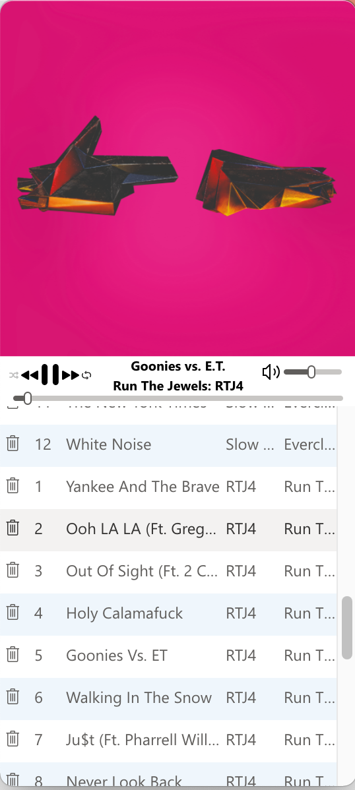

# EMP: Electron Music Player

> A little Hat Tip to us older Seattleites ;)

### Because macOS iTunes, er, "Music" doesn't play flac files

I'm old. I have a whole lot of music that I purchased on CD's over the past
many, many years. I like having high quality music playable from the computer
I'm working on. When that computer was a Windows PC, the incredibly ancient
Windows Media Player would play Flac, as would "Groove Music" I imagine (and
anything else probably, because of the pluggable (and highly overarchitected)
nature of audio/video handling in Windows). But I'm on a Mac on a regular basis
these days. Vox is **awful** (I'm not paying a monthly fee for the privilege of
listening to the music I've already purchased, thanks very much) and VLC is a
bad music player (a great video player, but not great for music, IMO)

What's it look like? Kind of like iTunes' ugly stepsister (#notadesigner!), but
here you go:

Releases are [here](https://github.com/kevinfrei/EMP/releases). I pretty
reliably get Mac & Windows releases up. Linux releases seem messier. Snapcraft
something something. I have a Raspi and a couple Ubuntu x86 machines but getting
everything working reliably just hasn't happened :/

## What's the current state?

It pretty much works. There are a few random minor bugs laying around. I mess
with it every month or so. Feel free to use it. Right now, I think I'm the only
user, and that's okay with me :)

## Stuff to do

I moved everything into [GitHub Issues](https://github.com/kevinfrei/EMP/issues)
to make book keeping & tracking easier. Go look there.
